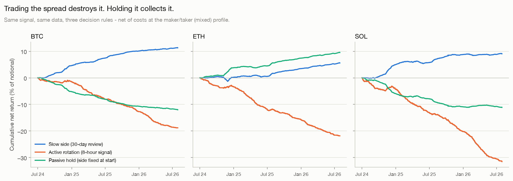
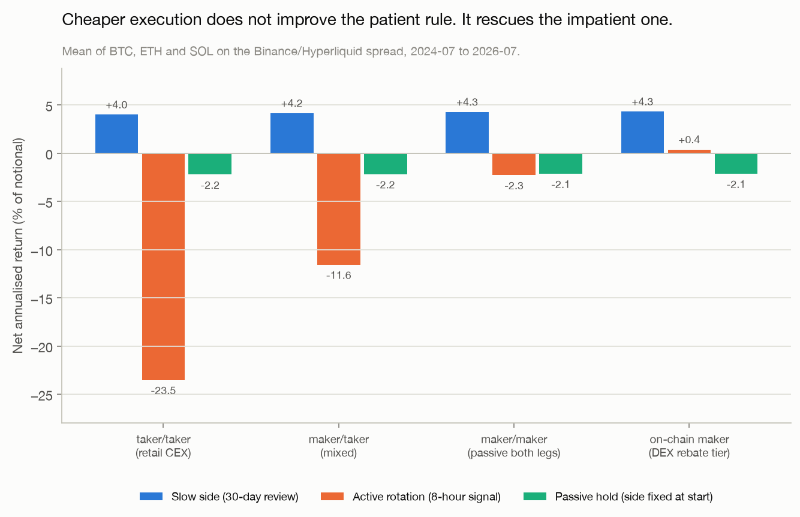
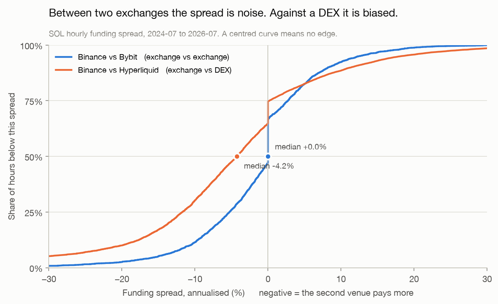
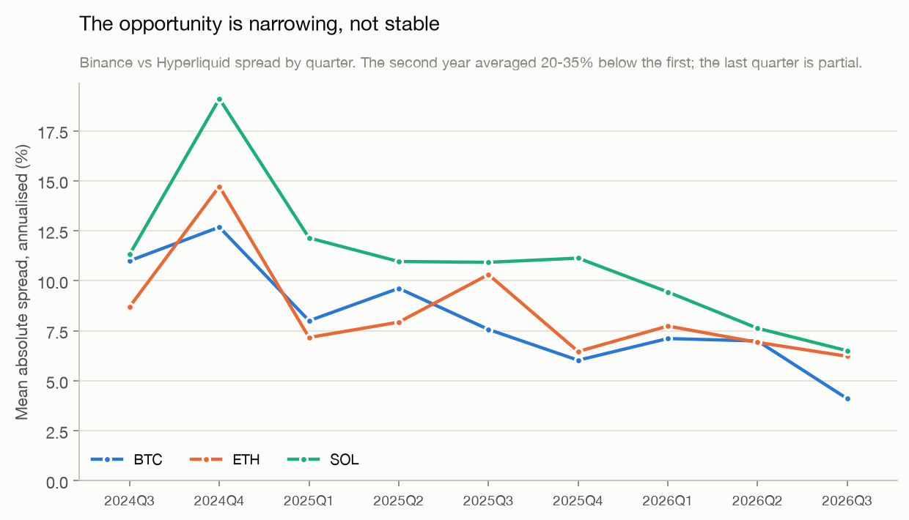

# Funding Rate Carry: what survives execution costs?

**Question.** Perpetual futures pay a periodic funding rate between longs and shorts. A position
long one perpetual and short another is directionally flat but still collects the difference
between the two funding rates. How much of that spread survives execution costs, and what is
actually being paid for?

**Data.** Two years of public funding and price history — July 2024 to July 2026, 18,208 hourly
observations per pair — for BTC, ETH and SOL across four venues: three centralised exchanges
(Binance, Bybit, OKX) and one on-chain perpetual DEX (Hyperliquid).

**Answer.** The spread is real and structural, and almost none of it is tradable in the way the
signal invites.

---

## Findings

**1. The cross-venue spread is a genuine bias, not noise.** The on-chain venue pays more than the
centralised one in 65–72% of hours, worth 8.5–11.4% annualised in absolute terms. The control —
the same measurement between two centralised exchanges — is centred on zero with a sign that is a
coin flip (41–47% stability). Two venues of the same type do not persistently disagree; an exchange
and a DEX do.

**2. But its level mean-reverts within hours.** An AR(1) fit puts the half-life of the
exchange-versus-DEX spread at **1.5–3.5 hours**, while one round trip costs 13 bps and needs
**100–135 hours** of holding to repay itself. The signal's direction is a regime that lasts months;
its level is hour-to-hour noise. Confusing the two is the whole trap.

**3. Trading it destroys it.** A threshold rule that enters when the trailing spread clears 10%
annualised earns the *most gross income* of any rule tested and finishes at **−9% to −15%
annualised** after costs. Execution consumed roughly three times the gross.

**4. The rule that barely trades is the one that works.** Holding continuously and revisiting only
*which* venue to short, on a 30-day clock, returned **+2.7% to +5.4% annualised net on notional**
with one to five round trips across two years, and a maximum drawdown under 2%.

**5. The margin is thinner than it looks, and shrinking.** The spread averaged 20–35% less in the
second year of the sample than the first, and sits 45–60% below its late-2024 peak. The patient
rule tolerates a round-trip cost above 250 bps before it breaks even; the active rule dies above
8 bps — no room for a bad fill or a fee-tier change.





Cheaper execution does not make the patient rule better — it hardly trades, so there is little to
save. What cheaper execution buys is *permission to be wrong about frequency*: it drags the active
rule from −24% a year to roughly break-even. That is not an edge.





---

## Why this framing

The interesting question about a carry trade is never "does the carry exist" — it does, and it is
directly observable, which is what makes perpetual funding a good subject. The question is what is
left after the cost of harvesting it, and what risk is being compensated.

So the analysis is built around three checks that a return figure on its own would hide:

- **A control.** The exchange-versus-DEX spread is measured alongside an exchange-versus-exchange
  pair, where no structural difference should exist. Without it, there is no way to distinguish a
  real bias from a wide-enough measurement.
- **A cost ladder.** Every rule is run at four execution profiles, from retail taker fees to an
  on-chain maker tier. A conclusion that survives only at one fee assumption is not a conclusion.
- **A decay check.** The two-year average is split by quarter, because a market being competed away
  looks profitable on average right up until it isn't.

---

## What's in here

```
notebooks/01_funding_carry_analysis.ipynb   the analysis, start here
src/fetch.py       public REST downloads, unit normalisation, local cache
src/analysis.py    spreads, cost model, break-even, three backtests
src/plots.py       charts
src/pipeline.py    end-to-end run; regenerates every figure
figures/           generated charts
data/              downloaded data (git-ignored)
```

```bash
pip install -r requirements.txt
```

```bash
python -m src.pipeline
```

That downloads everything and regenerates the figures. The notebook is the narrative version of the
same code path, so the numbers in it and the numbers above cannot drift apart. All data comes from
public REST endpoints — no API keys, no credentials, nothing authenticated.

---

## Method

1. **Normalise units first.** Binance, Bybit and OKX quote funding per 8-hour period; Hyperliquid
   quotes it per hour. Compared raw, the centralised venues look eight times more generous than
   they are. Every rate here is converted to a fraction per hour, and the interval is *inferred
   from the timestamps* rather than assumed — Binance moves volatile symbols to a 4-hour schedule,
   and a hard-coded constant fails silently on exactly the symbols with the widest spreads.
2. **Align by settlement, backwards.** A rate stamped 08:00 pays for the window that *ended* at
   08:00, so hours 00:00–07:00 accrue at that rate. Forward-filling instead shifts an 8-hour venue
   a full window against an hourly one and corrupts every spread computed from it.
3. **Model cost as a round trip across four crossings.** Two legs, each opened and closed. Fees and
   slippage are separate parameters because fees are contractual and slippage is realised.
4. **Fix the side at entry.** The favourable direction is only knowable once the rate has printed;
   recomputing it each hour would be look-ahead. Funding earned is the signed spread, which goes
   negative whenever the relationship inverts mid-trade.
5. **Measure what can be measured.** The gap between the two venues' prices — a real cost of
   filling two legs on two books — is taken from the data rather than assumed. Median 1.0–1.5 bps,
   99th percentile near 10, against a total fee budget of 4 bps at the cheapest profile.

---

## Limitations

In rough order of how much they matter:

- **No liquidation modelling.** Both legs post margin independently and margin is not fungible
  across venues. A sharp move can liquidate the losing leg while the winning one is still open,
  turning a market-neutral position directional at the worst moment. This is the dominant tail risk
  and none of it is in these numbers.
- **Returns are on notional, not on capital.** Both legs must be collateralised, so return on
  deployed capital depends on the margin regime and on leverage — which amplifies the liquidation
  risk above, not the carry.
- **No counterparty or protocol risk.** Exchange failure and contract failure are real,
  undiversifiable, and correlated with exactly the conditions that make the spread widest.
- **Slippage beyond the measured price gap is assumed**, not observed; real fills depend on book
  depth at the instant of execution.
- **Funding caps are ignored.** Venues bound their rates, truncating the extreme observations the
  strategy would most like to capture.
- **Survivorship and selection.** Only listed instruments appear in these endpoints, and the three
  assets here are the most liquid ones. Smaller assets show wider spreads and thinner books; that
  trade-off is not measured.
- **OKX publishes only three months of history**, so it is excluded from the two-year comparisons.
- **One historical path.** Two years, three assets, one regime. Nothing here establishes that the
  relationship holds out of sample.

---

## What I would do next

- Model margin and liquidation explicitly, and restate returns on capital rather than notional.
  Given the tail risk above, this is the difference between an interesting number and a usable one.
- Measure realised slippage against order-book snapshots instead of assuming it.
- Extend past the three most liquid assets, where the spread is wider and the book is thinner, and
  find where those two effects cross.
- Benchmark the net carry against a risk-free rate. A 4% return for bearing venue, protocol and
  liquidation risk deserves that comparison before anyone calls it an edge.

---

*The cost assumptions and the decision-rule structure come from operating a live implementation of
this strategy; that system is private and none of it is in this repository, which uses only public
data and public endpoints.*

*David Ayuso Pita — [LinkedIn](https://www.linkedin.com/in/david-ayuso-pita-306879207)*
